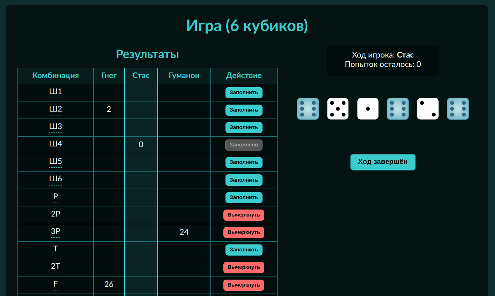

# 🎲 Кубики: Yahtzee с изюминкой

> **Кубики** — это браузерная многопользовательская кубиковая игра в стиле _Yahtzee_, но с глубокой системой подсчёта очков, возможностью играть с **5 или 6 кубиками**, и поддержкой от 2 до 6 игроков.  
> Отлично подходит для вечеринок, перерывов или тренировки стратегического мышления!



---

## 🌟 Особенности

- ✅ **Два режима**: классический (5 кубиков) или расширенный (6 кубиков)
- 👥 **Мультиплейер**: играйте с друзьями на одном устройстве (до 6 игроков)
- 🧠 **Глубокая стратегия**: удвоение очков при первом броске, бонусы за сложные комбинации, хитрая система верхней части
- 💡 **Подсказки в игре**: наведите курсор на любую комбинацию — и получите подробное объяснение
- ❓ **Руководство для новичков**: кнопка «?» в углу расскажет, что делать
- 🎨 **Красивый интерфейс**: тёмная тема, пиксельные кубики, плавные анимации

---

## 🌐 Запустить в браузере

- [https://int-i-equals-0.github.io/Yahtzee/](https://int-i-equals-0.github.io/Yahtzee/)

## 🚀 Как запустить локально

### Требования

- [Node.js](https://nodejs.org/) (v16+)

### Установка и запуск

```bash
# Клонировать репозиторий
git clone https://github.com/int-i-equals-0/Yahtzee.git
cd Yahtzee

# Установить зависимости
npm install

# Запустить dev-сервер
npm run dev
```

Приложение будет доступно по адресу: [http://localhost:5173](http://localhost:5173)

---

## 📜 Правила игры (кратко)

1. **Бросайте кубики** (до 3 раз за ход).
2. **Замораживайте** нужные кубики между бросками.
3. **Выберите комбинацию** (например, «Пара» или «Стрит») и запишите очки.
4. **Все 14–20 ячеек** должны быть заполнены к концу игры.
5. Побеждает игрок с **наибольшим итоговым счётом**.

> 💡 **Совет**: старайтесь получить сложные комбинации **с первого броска** — их очки **удваиваются**!

---

## 🛠 Технологии

- **Фронтенд**: [Vue 3](https://vuejs.org/) + [Vite](https://vitejs.dev/)
- **Управление состоянием**: [Pinia](https://pinia.vuejs.org/)
- **Стили**: CSS с кастомными переменными и шрифтами
- **Ассеты**: SVG-изображения кубиков

---

## 📦 Структура проекта

```
src/
├── assets/           # Шрифты, изображения кубиков, глобальные стили
├── components/       # Основные компоненты
│   └── steps/        # Экраны: выбор режима, настройка, игра, результат
├── utils/            # Логика подсчёта комбинаций
├── App.vue           # Корневой компонент
└── main.js           # Точка входа
```

---

## 🤝 Как помочь?

- Нашли баг? → [Создайте Issue](https://github.com/int-i-equals-0/Yahtzee/issues)
- Хотите добавить ботов, онлайн-мультиплеер или звуки? → Сделайте **Pull Request**!
- Есть идеи по улучшению правил или UX? → Напишите в Discussions!

---

## 📄 Лицензия

MIT © int-i-equals-0

---

> 🎯 **Совет для новичков**: начните с 5 кубиков и 2 игроков — так проще освоить механику!  
> Удачи и да пребудет с вами удача! 🎲✨
